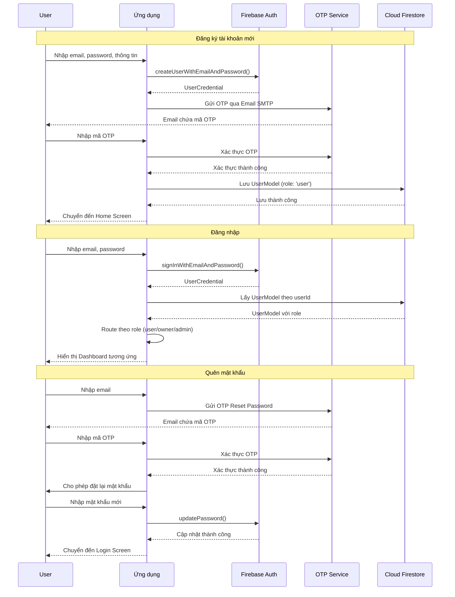
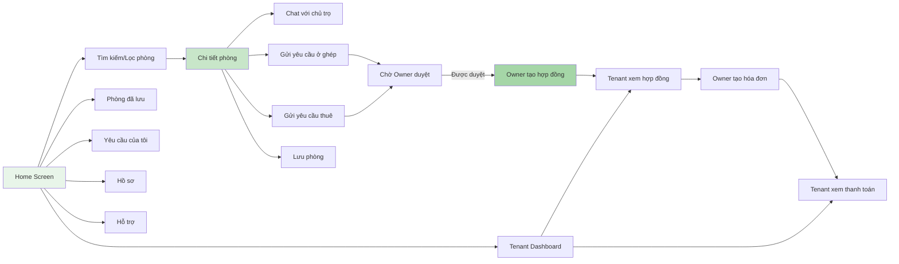
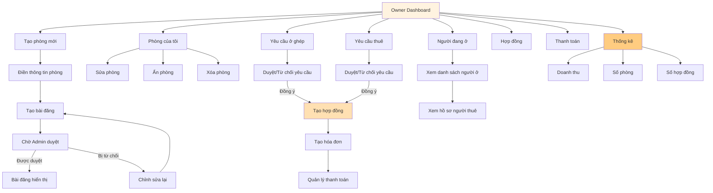
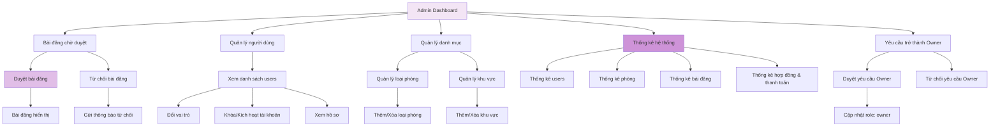
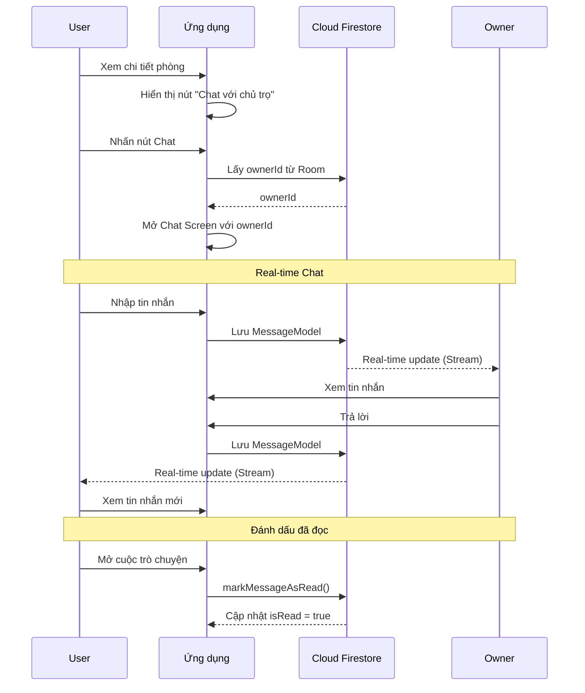
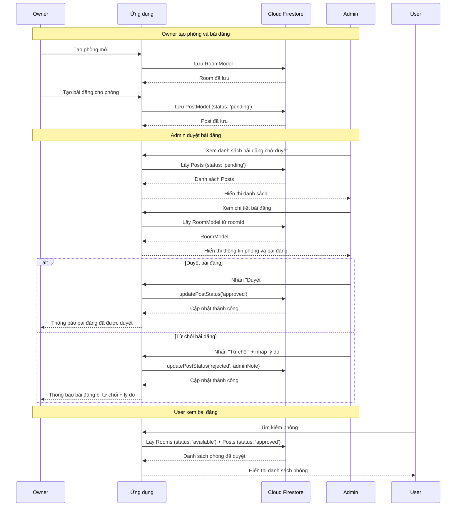
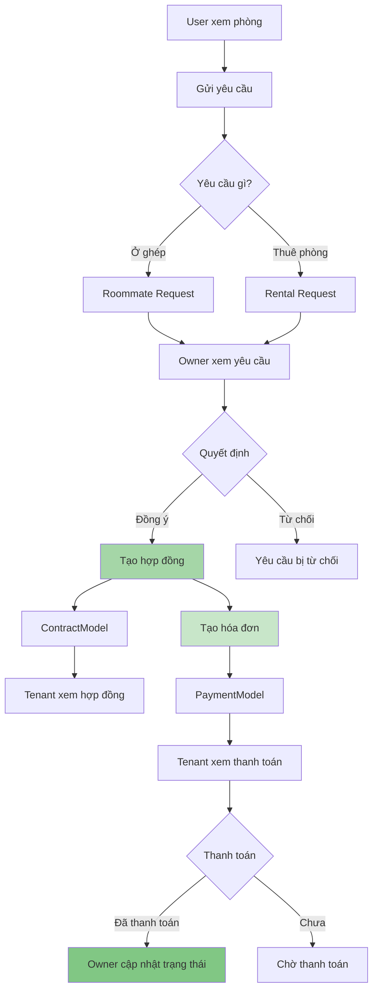
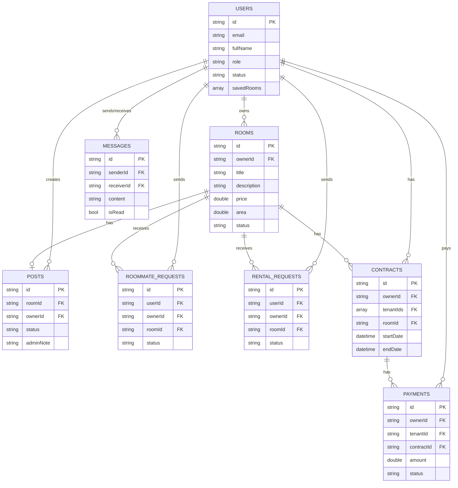

# Sơ Đồ Luồng Ứng Dụng Find Roommate App

## 📊 Sơ Đồ Tổng Quát

```mermaid
graph TB
    Start([Khởi động App]) --> Init[Khởi tạo Firebase]
    Init --> CheckAuth{Đã đăng nhập?}
    
    CheckAuth -->|Chưa| LoginScreen[Màn hình Đăng nhập]
    CheckAuth -->|Rồi| LoadUser[Load thông tin User]
    
    LoginScreen --> Register[Đăng ký]
    LoginScreen --> ForgotPass[Quên mật khẩu]
    LoginScreen --> Login[Đăng nhập]
    
    Register --> OTPVerify[Xác thực OTP Email]
    OTPVerify -->|Thành công| SaveUser[Lưu User vào Firestore]
    OTPVerify -->|Thất bại| Register
    
    ForgotPass --> OTPVerify2[Gửi OTP Reset]
    OTPVerify2 --> ResetPass[Đặt lại mật khẩu]
    ResetPass --> LoginScreen
    
    Login --> LoadUser
    SaveUser --> LoadUser
    
    LoadUser --> CheckRole{Phân quyền User}
    
    CheckRole -->|user| UserHome[Home Screen - User]
    CheckRole -->|owner| OwnerDashboard[Owner Dashboard]
    CheckRole -->|admin| AdminDashboard[Admin Dashboard]
    
    %% User Flow
    UserHome --> BrowseRooms[Tìm kiếm/Lọc phòng]
    BrowseRooms --> RoomDetail[Chi tiết phòng]
    RoomDetail --> Chat[Chat với chủ trọ]
    RoomDetail --> SendRequest[Gửi yêu cầu]
    RoomDetail --> SaveRoom[Lưu phòng yêu thích]
    
    SendRequest --> RoommateReq[Yêu cầu ở ghép]
    SendRequest --> RentalReq[Yêu cầu thuê phòng]
    
    UserHome --> MyRequests[Yêu cầu của tôi]
    UserHome --> SavedRooms[Phòng đã lưu]
    UserHome --> TenantDashboard[Tenant Dashboard]
    UserHome --> Profile[Hồ sơ cá nhân]
    UserHome --> Support[Hỗ trợ]
    
    TenantDashboard --> ViewContracts[Xem hợp đồng]
    TenantDashboard --> ViewPayments[Xem thanh toán]
    
    %% Owner Flow
    OwnerDashboard --> CreateRoom[Tạo phòng mới]
    OwnerDashboard --> MyRooms[Phòng của tôi]
    OwnerDashboard --> ManageRoommateReq[Quản lý yêu cầu ở ghép]
    OwnerDashboard --> ManageRentalReq[Quản lý yêu cầu thuê]
    OwnerDashboard --> ViewOccupants[Xem người ở]
    OwnerDashboard --> Contracts[Quản lý hợp đồng]
    OwnerDashboard --> Payments[Quản lý thanh toán]
    OwnerDashboard --> Statistics[Thống kê doanh thu]
    
    CreateRoom --> CreatePost[Tạo bài đăng]
    CreatePost --> WaitApproval[Chờ Admin duyệt]
    
    MyRooms --> EditRoom[Sửa phòng]
    MyRooms --> HideRoom[Ẩn phòng]
    MyRooms --> DeleteRoom[Xóa phòng]
    
    ManageRoommateReq --> ApproveRoommate[Duyệt/Từ chối ở ghép]
    ManageRentalReq --> ApproveRental[Duyệt/Từ chối thuê]
    
    ApproveRoommate --> CreateContract
    ApproveRental --> CreateContract[Tạo hợp đồng]
    CreateContract --> CreatePayment[Tạo hóa đơn]
    
    %% Admin Flow
    AdminDashboard --> PendingPosts[Bài đăng chờ duyệt]
    AdminDashboard --> UserManagement[Quản lý người dùng]
    AdminDashboard --> CategoryManagement[Quản lý danh mục]
    AdminDashboard --> AdminStatistics[Thống kê hệ thống]
    AdminDashboard --> OwnerRequests[Yêu cầu trở thành Owner]
    
    PendingPosts --> ApprovePost[Duyệt bài đăng]
    PendingPosts --> RejectPost[Từ chối bài đăng]
    
    UserManagement --> ChangeRole[Đổi vai trò]
    UserManagement --> BanUser[Khóa tài khoản]
    
    CategoryManagement --> AddCategory[Thêm danh mục]
    CategoryManagement --> DeleteCategory[Xóa danh mục]
    
    OwnerRequests --> ApproveOwner[Duyệt yêu cầu Owner]
    OwnerRequests --> RejectOwner[Từ chối yêu cầu]
    
    %% Logout
    UserHome --> Logout[Đăng xuất]
    OwnerDashboard --> Logout
    AdminDashboard --> Logout
    Logout --> LoginScreen
    
    style Start fill:#e1f5ff
    style LoginScreen fill:#fff4e6
    style UserHome fill:#e8f5e9
    style OwnerDashboard fill:#fff3e0
    style AdminDashboard fill:#f3e5f5
    style Logout fill:#ffebee
```

## 🔐 Luồng Xác Thực Chi Tiết

## 👤 Luồng Người Dùng (User)

## 🏠 Luồng Chủ Trọ (Owner)

## 👨‍💼 Luồng Quản Trị Viên (Admin)

## 💬 Luồng Chat

## 📝 Luồng Tạo và Duyệt Bài Đăng

## 🔄 Luồng Yêu Cầu và Hợp Đồng

## 🗄️ Cấu Trúc Database (Firestore)

## 🎯 Tóm Tắt Luồng Chính

### 1. **Luồng Khởi Động**
- App khởi động → Khởi tạo Firebase
- Kiểm tra trạng thái đăng nhập
- Nếu chưa đăng nhập → Login Screen
- Nếu đã đăng nhập → Load User → Route theo role

### 2. **Luồng Xác Thực**
- Đăng ký → Xác thực OTP → Lưu User (role: 'user')
- Đăng nhập → Kiểm tra role → Route đến Dashboard tương ứng
- Quên mật khẩu → OTP → Đặt lại mật khẩu

### 3. **Luồng User**
- Tìm kiếm/Lọc phòng → Xem chi tiết → Chat/Gửi yêu cầu
- Quản lý yêu cầu → Xem hợp đồng → Xem thanh toán
- Lưu phòng yêu thích → Xem lại sau

### 4. **Luồng Owner**
- Tạo phòng → Tạo bài đăng → Chờ Admin duyệt
- Quản lý yêu cầu → Duyệt/Từ chối → Tạo hợp đồng
- Tạo hóa đơn → Quản lý thanh toán → Xem thống kê

### 5. **Luồng Admin**
- Duyệt bài đăng → Duyệt/Từ chối
- Quản lý người dùng → Đổi role/Khóa tài khoản
- Quản lý danh mục → Thêm/Xóa
- Xem thống kê hệ thống

### 6. **Luồng Real-time**
- Chat: Stream messages từ Firestore
- Yêu cầu: Stream requests với trạng thái real-time
- Thanh toán: Stream payments với cập nhật real-time

---

**Ghi chú:**
- Tất cả các luồng đều sử dụng **Firebase Firestore** làm database
- **Real-time updates** được thực hiện qua StreamBuilder
- **State management** sử dụng **Riverpod**
- **UI/UX** được thiết kế với **Material 3**

